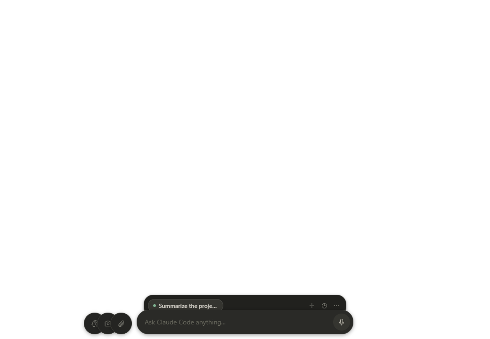
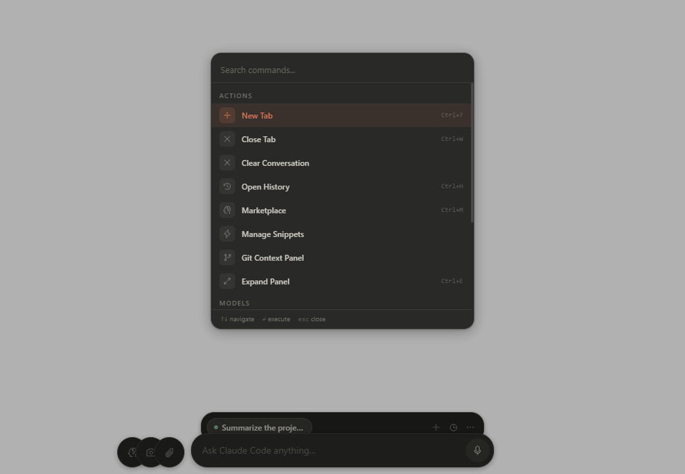

# Clui CC

Clui CC is an Electron overlay for Claude Code CLI. It keeps Claude in a floating desktop shell with tabs, workflows, diffs, permissions, costs, and Git-aware context so you can stay inside your coding flow without living in the terminal.

The app runs locally on macOS, Windows, and Linux, talks to Claude through the installed `claude` CLI, and keeps the renderer, preload bridge, and main-process orchestration clearly separated.

## What Is Clui CC

Clui CC is a desktop companion for Claude Code. The renderer gives you a focused chat-and-tools UI, the preload layer exposes a typed `window.clui` bridge, and the main process manages Claude sessions, permission hooks, marketplace installs, screenshots, notifications, and local state.

If you already use Claude Code in the terminal, Clui CC adds the interface and workflow layer on top: multi-tab conversations, inline tool diffs, session history, cost tracking, voice input, and project-specific context management.

## Features

- Multi-tab sessions with drag-to-reorder and tab groups
- Command palette (Ctrl+K / Cmd+K)
- Inline code diff viewer for Edit/Write tool calls
- Cost dashboard with usage analytics
- Multi-model comparison (split view)
- Workflow chains / macros
- Git-aware context panel
- OS native + in-app toast notifications
- Marketplace for skills and plugins
- Customizable keyboard shortcuts
- Session export (Markdown/JSON)
- Snippets and prompt templates
- Context files auto-attach
- Permission approval with auto-deny timeout and auto-permission mode
- Voice input (Whisper)
- Dark/light/system theme (3-way selector)
- Welcome card with example prompt chips
- Dead session recovery card
- Queue full toast notification
- Keyboard-accessible toolbar and tab controls (ARIA)
- Permission focus rings and command palette ARIA attributes
- Image protocol support (2MB guard + lightbox)
- Mouse protocol support in terminal
- Linux support (AppImage/deb/rpm) with Wayland awareness
- Responsive panel widths with ResizeObserver

## Screenshots

<table>
  <tr>
    <td width="50%" valign="top">
      
      <br />
      <strong>Conversation shell</strong><br />
      Expanded dark-mode session with a live Claude response, attachments, and the floating overlay layout.
    </td>
    <td width="50%" valign="top">
      
      <br />
      <strong>Command palette</strong><br />
      Search-first launcher for navigation, theme switching, marketplace access, and model actions.
    </td>
  </tr>
  <tr>
    <td width="50%" valign="top">
      
      <br />
      <strong>Permission setup</strong><br />
      First-launch wizard for choosing a safe Claude permissions preset before starting work.
    </td>
    <td width="50%" valign="top">
      
      <br />
      <strong>Permission editor</strong><br />
      In-app management for `~/.claude/settings.json` permission patterns and presets.
    </td>
  </tr>
  <tr>
    <td width="50%" valign="top">
      
      <br />
      <strong>Usage dashboard</strong><br />
      Cost, token, model, and project analytics surfaced directly inside the overlay.
    </td>
    <td width="50%" valign="top">
      
      <br />
      <strong>Snippet manager</strong><br />
      Slash-command templates for reusable prompts and lightweight workflow shortcuts.
    </td>
  </tr>
  <tr>
    <td width="50%" valign="top">
      
      <br />
      <strong>Workflow editor</strong><br />
      Build multi-step prompt chains with ordered steps and simple editing controls.
    </td>
    <td width="50%" valign="top">
      
      <br />
      <strong>Workflow manager</strong><br />
      Browse, run, and maintain saved prompt chains from a dedicated panel.
    </td>
  </tr>
</table>

These screenshots were captured from the Electron app in isolated E2E mode with the fake Claude backend so the visuals stay deterministic in the repo. The workflow and snippet examples were seeded locally through the real UI rather than mocked in the README itself.

## Prerequisites

- macOS 13+, Windows 10+, or Linux (X11/Wayland)
- Node.js 18+
- Claude Code CLI 2.1+
- macOS: Xcode Command Line Tools recommended for native dependency rebuilds
- Windows: Visual Studio Build Tools recommended for native dependency rebuilds
- Linux: `build-essential` / `base-devel` for native dependency rebuilds (see [docs/LINUX.md](docs/LINUX.md))

Verify your environment before starting:

```bash
node --version
npm --version
claude --version
```

## Quick Start

Clone the repo and install dependencies:

```bash
git clone https://github.com/lfrmonteiro99/clui-cc-windows.git
cd clui-cc-windows
npm install
```

Run the platform doctor if you want a quick environment check:

```bash
npm run doctor          # macOS / Linux
npm run doctor:win      # Windows
```

Start the desktop app in development:

```bash
npm run dev
```

Run validation and create a production build:

```bash
npm run test
npm run build
```

## Architecture

Clui CC is split into three runtime layers plus the Claude Code CLI. The renderer owns the UI and local interaction state, the preload script exposes a typed IPC surface, and the main process owns subprocesses, permissions, sessions, marketplace installs, notifications, screenshots, and diagnostics.

```text
+--------------------+    window.clui / IPC    +--------------------+    IPC handlers / services    +-----------------------+
| Renderer           | <---------------------> | Preload            | <---------------------------> | Main                  |
| React 19           |                         | contextBridge      |                               | ControlPlane          |
| Zustand stores     |                         | typed API surface  |                               | RunManager            |
| Command palette    |                         |                    |                               | Permission server     |
| Conversations      |                         |                    |                               | Marketplace / Git     |
+--------------------+                         +--------------------+                               +-----------------------+
                                                                                                             |
                                                                                                             v
                                                                                                   +-------------------+
                                                                                                   | Claude Code CLI   |
                                                                                                   | stream-json runs  |
                                                                                                   | local subprocess  |
                                                                                                   +-------------------+
```

For a deeper breakdown of the renderer stores, main-process services, IPC channels, and prompt-to-response flow, see [docs/ARCHITECTURE.md](docs/ARCHITECTURE.md).

## Platform Guides

- [docs/LINUX.md](docs/LINUX.md) — Linux setup, Wayland workarounds, terminal/screenshot detection, troubleshooting
- [docs/WINDOWS.md](docs/WINDOWS.md) — Windows setup, shortcuts, terminal providers, troubleshooting

## Links

- [CONTRIBUTING.md](CONTRIBUTING.md)
- [SECURITY.md](SECURITY.md)
- [docs/ARCHITECTURE.md](docs/ARCHITECTURE.md)
